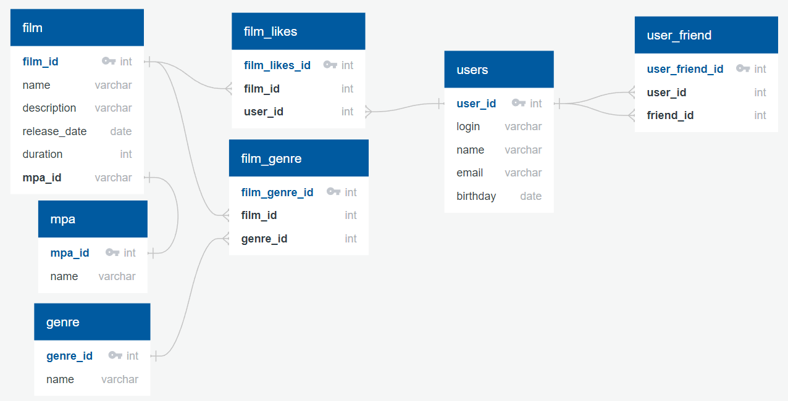

# java-filmorate
Template repository for Filmorate project.

 

В проекте помимо базовых, выполнены следуюцие задания:
## Функциональнось поиск -3 балла
## Добавление режиссёров в фильмы -4 балла 
## Функциональность  «Отзывы» -4 балла
## Функциональность «Лента событий» -3 балла
## Удаление фильмов и пользователей -2 балла
## Функциональность «Общие фильмы» -1 балл
## Вывод самых популярных фильмов по жанру и годам -2 балла
## Функциональность «Рекомендации» реализована не в полне коретно 
## Всего 19 баллов